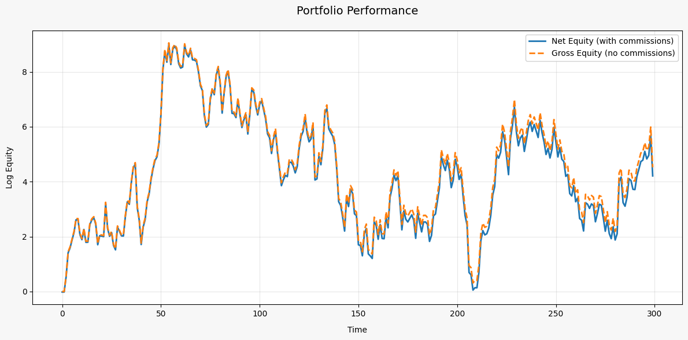

# MLTT

Machine Learning Trading Toolkit. Library for portfolio rebalancing strategy research and development.

## Getting started

Modules rewiew:
- `allocation` - Base module for backtesting and strategies
- `alphas` - Experemental formulaic alpha (WorldQuant-like) factor generation
- `data_loading` - Binance and DefiLlama downloader and formatter
- `models` - Implemented strategies
- `options` - Pricing binary outcomes (PolyMarket-like)
- `orderbook` - Limit orderbook (LOB) feature extraction
- `report` - Risk/Performance reports: metrics, vizualization, etc.
- `technical` - Obvious market features
- `validation` - Future leakage checks, strategy testing on subsets of a universe
- `cache` - Caching backend with modes
- `data_split` - Splitting data into train/val/test
- `utils` - Unstructured handy functions and settings 

### Creating a Strategy
Strategy takes a torch.Tensor input and output is also torch.Tensor
> Important note: Sum of absolute values in a row of output weights neet to be `<= 1`. Assuming maximum 100% deposit usage and 1x leverage for short selling
> All the code assumes using log-prices

```python
class CapitalAllocator(ABC):
    """
    Abstract base class for capital allocation models.
    
    Capital allocators predict weights for tradable assets based on input data.
    """
    
    @abstractmethod
    def predict(self, x: torch.Tensor) -> torch.Tensor:
        """
        Predict allocation weights based on input data.
        
        Args:
            - `x` (torch.Tensor): Tensor of data. shape: `(batch_size, >=min_observations, *n_information)` \
                `n_information` is number of features. Usually `n_information` = `n_tradable`
        Returns:
            torch.Tensor: Tensor of predicted weights. shape: `(batch_size, n_tradable)`. Sum of each abs(row) is 1
        """
        pass

    @property
    @abstractmethod
    def min_observations(self) -> int:
        """
        Minimum number of observations required for prediction.
        
        Returns:
            int: Minimum number of observations
        """
        ...
```

#### Time Series Momentum Example

This example demonstrates a simple time series momentum strategy that takes long positions in assets with positive returns and short positions in assets with negative returns.

```python
import torch
from MLTT import CapitalAllocator
from MLTT.utils import change, to_weights_matrix

class TimeSeriesMomentum(CapitalAllocator):
    def __init__(self, lookback_period: int = 252):
        """
        Args:
            lookback_period (int): Number of days to look back for momentum calculation
        """
        self.lookback_period = lookback_period
        
    @property
    def min_observations(self) -> int:
        return self.lookback_period + 1
        
    def predict(self, x: torch.Tensor) -> torch.Tensor:
        """
        Predict portfolio weights based on past returns momentum.
        
        Args:
            x (torch.Tensor): Price tensor with shape (time_steps, n_assets)
            
        Returns:
            torch.Tensor: Portfolio weights with shape (time_steps, n_assets)
        """
        # Calculate returns over lookback period
        returns = change(x, lag=self.lookback_period)

        signs = torch.sign(returns)

        # Normalize to valid portfolio weights
        weights = to_weights_matrix(signs)
        
        return weights

if __name__ == "__main__":
    # Generate some random price data
    n_assets = 3
    n_days = 300
    prices = torch.randn(n_days, n_assets).cumsum(dim=0)
    log_prices = torch.log(prices)
    
    strategy = TimeSeriesMomentum(lookback_period=60)
    weights = strategy(prices)
    print(f"Portfolio weights: {weights.numpy()}")
```

This strategy:
1. Takes price data as input
2. Calculates returns over specified lookback period
3. Takes long positions (+) in assets with positive returns
4. Takes short positions (-) in assets with negative returns
5. Normalizes weights to ensure sum of absolute values equals 1

The weights can be used for portfolio rebalancing, with positive weights indicating long positions and negative weights indicating short positions.

### Backtesting
All backtest functions assume using log-prices as inputs. This is important for accurate calculation of returns and portfolio performance.

The `backtest_model` function allows you to test your capital allocation strategies with historical data. This function takes your model and price data, and returns a backtest result with performance metrics.

```python
import torch
from MLTT.allocation import backtest_model

# Create your strategy
strategy = TimeSeriesMomentum(lookback_period=60)

result = backtest_model(
    model=strategy,
    prices=log_prices,
    commission=0.01,  # 1% trading commission
    save_weights=True  # Save portfolio weights for analysis
)

# Access equity curve and other metrics
print(f"Final equity: {torch.exp(result.log_equity[-1]).item()}")
print(f"Gross equity: {torch.exp(result.gross_equity[-1]).item()}")
print(f"Total expenses: {result.expenses_log.sum().item()}")
```

Vizualization of `result.log_equity` and `result.gross_equity`


#### Custom Input Data
You're not limited to using just price data for your strategies. The `backtest_model` function accepts a `prediction_info` parameter that allows you to provide custom data to your model:

```python
# Example with custom input data
result = backtest_model(
    model=strategy,
    prices=log_prices,             # Log-prices for calculating returns
    prediction_info=custom_data,   # Custom data for the model
    commission=0.001
)
```

Your custom data can include orderbook information, alternative data sources, technical indicators, or any other features you want your model to consider. This gives you flexibility to develop strategies beyond just using closing prices, such as:

- Market microstructure models using orderbook data
- Sentiment-based strategies using news or social media data
- Multi-factor models combining various data sources
- etc.

### Making reports
Using `MLTT.report` module you can easily make performance/risk reports for strategies.

```python
from MLTT.report import StrategyReporter
from MLTT.report.metrics import ALL_METRICS, AnnualSharpe, MaxDrawdown, AnnualMean

# Use all available metrics
reporter = StrategyReporter(ALL_METRICS)
report = reporter.compose_report(backtest_result)

# Print report as markdown table
print(report.as_markdown())

# Use specific metrics
custom_reporter = StrategyReporter([
    AnnualSharpe(T=252),           # Annualize using 252 trading days
    MaxDrawdown(),
    AnnualMean(T=252)
])
report = custom_reporter.compose_report(backtest_result)

# Get raw values
numeric_report = custom_reporter.compose_report(backtest_result, mode='numeric')
sharpe = numeric_report.values['Annual Sharpe Ratio (Annualization: 252, Risk Free Rate: 0%)']
```

#### Creating Custom Metrics

You can create custom metrics by inheriting from the `Metric` base class:

```python
from MLTT.report.metrics import Metric
from MLTT.allocation.backtesting import BTResult

class CustomMetric(Metric):
    @property
    def name(self) -> str:
        return "My Custom Metric"
    
    def calculate(self, backtest_result: BTResult) -> float:
        # Your calculation logic here
        return some_value
    
    @classmethod
    def format_value(cls, value: float) -> str:
        return f"{value:.2f}"  # Format as you want

# Use your custom metric
reporter = StrategyReporter([CustomMetric(), AnnualSharpe()])
```
### Updating parameters
Useful and convinient feature is changing parameters for all metrics:
```python
# Setting timeframe to 1h and risk free rate to 10%/year
reporter.update_all_metrics_params(T=24*365, rf=0.1)
```

#### Markdown in Jupyter

Markdown reports by default uses visual mode.

```python
reporter.compose_report(result).as_markdown()
```

Report for all metrics may look similar to table below.

| Metric | Value |
|--------|--------|
| Annual Mean (Annualization: 1095) | -57.82% |
| Monthly Mean (Annualization: 1095) | -4.82% |
| Annual Standard Deviation (Annualization: 1095) | 45.11% |
| Annual Sharpe Ratio (Annualization: 1095, Risk Free Rate: 2.0%) | -1.33 |
| Annual Sortino Ratio (Annualization: 1095, Risk Free Rate: 2.0%) | -1.43 |
| Annual Calmar Ratio (Annualization: 1095, Risk Free Rate: 2.0%) | -0.96 |
| Maximum Drawdown | 61.99% |
| Average Drawdown | 22.85% |
| Median Drawdown | 23.02% |
| Value at Risk (confidence=95.0%) | 2.34% |
| Conditional Value at Risk (confidence=95.0%) | 3.64% |
| Ulcer Index | 0.27 |
| Skewness | -0.7037 |
| Excess Kurtosis | 9.7834 |
| Average Drawdown Duration | 60d 4h |
| Max Drawdown Duration | 295d 7h |
| Average Position Duration | 6d 9h |
| Daily Turnover (Annualization: 1095) | 18.32% |

### Caching

The library uses tensor caching by default when running backtests and calculating built-in indicators to improve performance. To manage memory usage, you can use the `cache_mode` context manager:

```python
from MLTT.cache import cache_mode, CacheMode

# Read-only mode - use existing caches but don't create new ones
with cache_mode(CacheMode.READ_ONLY): # or cache_mode("READ_ONLY")
    result = backtest_model(model=strategy, prices=log_prices)
```

Also available caching modes:
- `READ_ONLY`
- `READ_WRITE` - By default
- `DISABLED`

Cache size can be changed in `MLTT.utils`